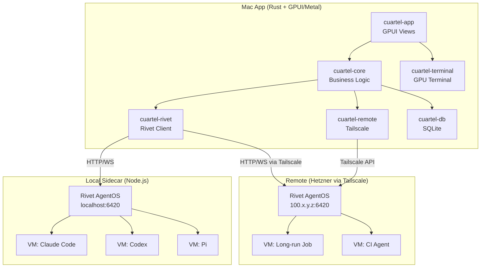
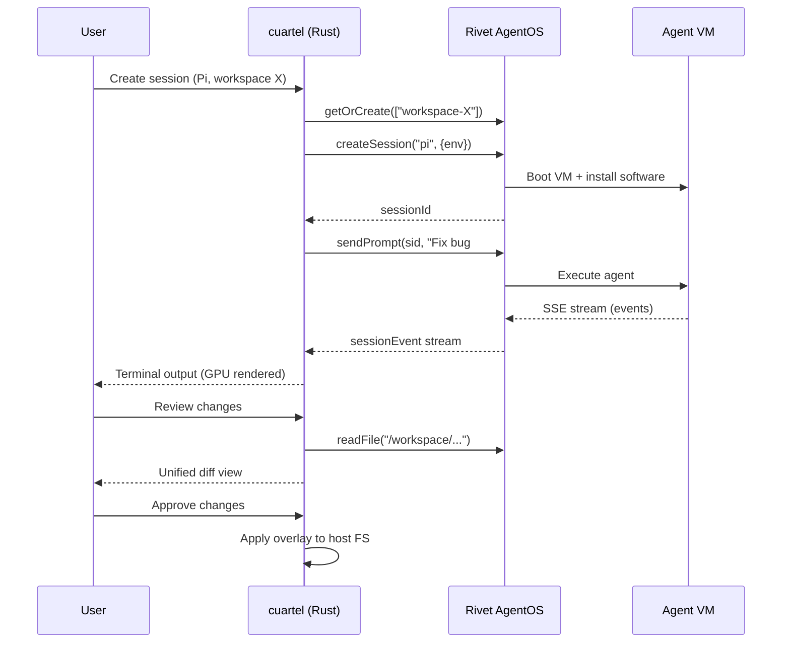
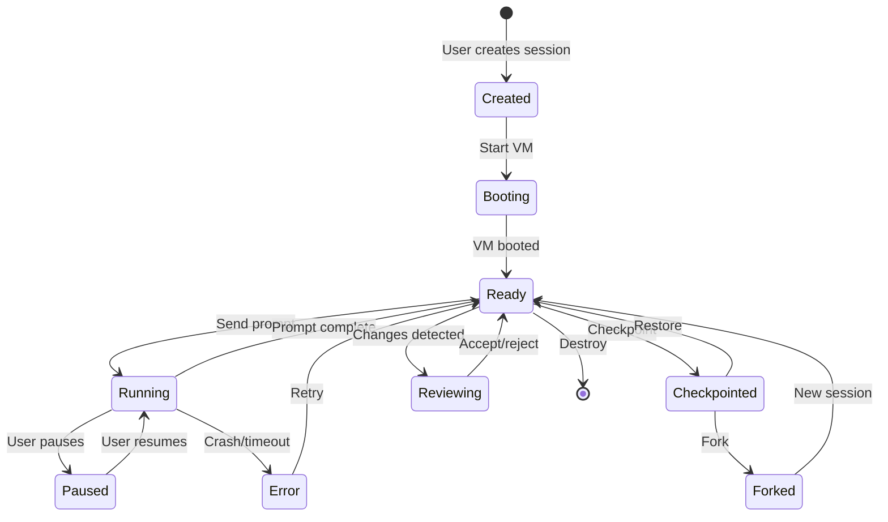

# Cuartel

A 100% Rust native macOS app, GPU-rendered with Metal via GPUI. Orchestrates AI coding agent sessions in isolated VMs using Rivet AgentOS, with local and remote execution via Tailscale.

---

## Architecture Overview



### Key Architectural Decisions

| Decision | Choice | Rationale |
|---|---|---|
| UI Framework | **GPUI** (gpui crate from Zed) | Metal-native GPU rendering, proven terminal support, SuperHQ validates the approach |
| VM/Sandbox | **Rivet AgentOS** | Unified API for local + remote, built-in persistence, multi-agent orchestration, actor model |
| Rivet integration | **Node.js sidecar** managed by the Rust app | AgentOS is a Node.js runtime; Rust app spawns/manages the sidecar, communicates via HTTP/WebSocket |
| Local storage | **SQLite** (AES-256-GCM for secrets) | Workspace config, credentials, server registry, session metadata |
| Remote connectivity | **Tailscale** | Encrypted mesh networking, no port forwarding/VPN setup, Rust crate available (`tailscale-api`) |
| Credential security | **Auth gateway pattern** | Credentials never enter VMs; injected on-the-fly into outgoing API requests by host-side proxy |

---

## Data Flow: Agent Session Lifecycle



---

## Crate Structure

```
cuartel/
├── Cargo.toml                    # Workspace root
├── crates/
│   ├── cuartel-app/              # Main GPUI application binary
│   │   └── src/
│   │       ├── main.rs           # Entry point, GPUI app init
│   │       ├── app.rs            # Global app state, menu bar
│   │       ├── workspace.rs      # Workspace view (container)
│   │       ├── sidebar.rs        # Session list, server list
│   │       ├── tab_bar.rs        # Agent tabs within workspace
│   │       ├── diff_view.rs      # Unified diff review panel
│   │       ├── ports_panel.rs    # Port forwarding management
│   │       ├── settings.rs       # Settings: keys, agents, servers
│   │       └── theme.rs          # Color scheme, fonts
│   │
│   ├── cuartel-terminal/         # GPU-accelerated terminal emulator
│   │   └── src/
│   │       ├── lib.rs
│   │       ├── terminal.rs       # PTY management, ANSI parsing
│   │       └── renderer.rs       # GPUI element for terminal grid
│   │
│   ├── cuartel-core/             # Core business logic (no UI deps)
│   │   └── src/
│   │       ├── lib.rs
│   │       ├── session.rs        # Session lifecycle, state machine
│   │       ├── agent.rs          # Agent harness registry (Pi, CC, etc.)
│   │       ├── checkpoint.rs     # Checkpoint/rewind logic
│   │       ├── overlay.rs        # Overlay FS diff computation
│   │       ├── auth_gateway.rs   # Credential injection proxy
│   │       └── config.rs         # App configuration
│   │
│   ├── cuartel-rivet/            # Rivet AgentOS client (HTTP/WS)
│   │   └── src/
│   │       ├── lib.rs
│   │       ├── client.rs         # HTTP + WebSocket client
│   │       ├── sidecar.rs        # Spawn/manage local Node.js process
│   │       ├── vm.rs             # VM CRUD, lifecycle
│   │       ├── session.rs        # Agent sessions, prompts, events
│   │       ├── filesystem.rs     # File read/write/diff
│   │       └── network.rs        # Port forwarding, vmFetch
│   │
│   ├── cuartel-remote/           # Remote server management
│   │   └── src/
│   │       ├── lib.rs
│   │       ├── tailscale.rs      # Tailscale discovery + connectivity
│   │       ├── server.rs         # Remote server registry
│   │       └── sync.rs           # Session push/pull between locations
│   │
│   └── cuartel-db/               # SQLite persistence
│       └── src/
│           ├── lib.rs
│           ├── schema.rs         # Tables: workspaces, credentials, servers
│           └── crypto.rs         # AES-256-GCM for secrets at rest
│
├── rivet/                        # Rivet AgentOS sidecar config
│   ├── package.json              # rivetkit + agent-os packages
│   ├── server.ts                 # AgentOS server entry point
│   └── tsconfig.json
│
├── migrations/                   # SQLite migrations
├── assets/                       # App icon, fonts
├── Info.plist                    # macOS app bundle metadata
├── entitlements.plist            # Virtualization, networking entitlements
└── scripts/
    └── package.sh                # Build + package as .dmg
```

---

## Session State Machine



---

## Core Features by Phase

### Phase 1 -- Scaffolding (the starting point)
- Rust workspace with all crates stubbed out
- GPUI window with sidebar + main content area
- Basic theme (dark mode)
- SQLite setup with initial schema
- Build script that produces a `.app` bundle

### Phase 2 -- Terminal + Sidecar
- GPU-accelerated terminal emulator in GPUI (adapt patterns from SuperHQ's `gpui-terminal` crate)
- Node.js sidecar management: auto-install `rivetkit` deps, spawn/monitor the Rivet server process
- Rust HTTP client for Rivet AgentOS API (using `reqwest` + `tokio-tungstenite` for WebSocket)

### Phase 3 -- Agent Sessions
- Create sessions for Pi (first supported agent, best Rivet support)
- Stream session events to terminal in real-time via WebSocket/SSE
- Permission handling UI (approve/deny tool use)
- Session list in sidebar with status indicators
- Add Claude Code, Codex, OpenCode harness support

### Phase 4 -- Workspaces + Review
- Workspace model: one project directory mapped per workspace
- Overlay filesystem: mount project at `/workspace` in VM, changes stay in overlay
- Unified diff review panel (side-by-side or inline)
- Accept/reject per-file or per-hunk before applying to host filesystem
- Multiple tabs per workspace (different agents on same project)

### Phase 5 -- Security + Ports
- Auth gateway: reverse proxy on host that injects API keys into outgoing requests
- Encrypted credential storage (AES-256-GCM in SQLite)
- Port forwarding: opt-in per-port, sandbox-to-host and host-to-sandbox
- Firewall rules: VMs have no direct access to secrets

### Phase 6 -- Checkpoint + Rewind
- Checkpoint full VM state (leveraging Rivet's persistent state)
- Restore from checkpoint in seconds
- Fork a checkpoint into a new session/branch
- Timeline UI showing checkpoint history

### Phase 7 -- Remote via Tailscale
- Tailscale integration: discover machines on your tailnet
- Connect to remote Rivet AgentOS instances over Tailscale
- Server registry in sidebar (local machine + remote machines)
- Session sync: push a local session to remote, pull a remote session to local
- Long-running jobs on Hetzner while using own API subscriptions

### Phase 8 -- Orchestration
- Multi-agent pipelines (coder -> reviewer -> tester)
- Cron-based scheduled agents
- Durable workflows (survive crashes via Rivet's workflow engine)
- Agent-to-agent file passing and coordination

---

## Key Dependencies

| Crate | Purpose |
|---|---|
| `gpui` (unofficial) | GPU-accelerated UI framework via Metal |
| `reqwest` | HTTP client for Rivet API |
| `tokio-tungstenite` | WebSocket client for real-time event streaming |
| `rusqlite` | SQLite for local persistence |
| `ring` or `aes-gcm` | AES-256-GCM encryption for secrets |
| `tailscale-api` | Tailscale network discovery and management |
| `similar` | Diff computation for review panel |
| `alacritty_terminal` | Terminal emulation (VT100/ANSI parsing) |
| `serde` / `serde_json` | Serialization for Rivet API protocol |
| `tokio` | Async runtime |
| `notify` | Filesystem watching for overlay changes |

---

## Rivet AgentOS Integration Detail

The Rust app does NOT embed Rivet (it's Node.js). Instead:

1. **Local**: On first launch, `cuartel` checks for Node.js, installs the `rivet/` sidecar deps (`npm install`), then spawns `npx tsx server.ts` as a managed child process. The Rust app connects to `http://localhost:6420`.

2. **Remote**: User configures a Hetzner/any server in settings. The server runs its own Rivet AgentOS instance. The Rust app connects to it via Tailscale at `http://100.x.y.z:6420`.

3. **API Surface** (Rust client wraps these):
   - `POST /vm/getOrCreate` -- create/get VM instance
   - `POST /vm/{id}/createSession` -- start agent session
   - `POST /vm/{id}/sendPrompt` -- send prompt to agent
   - `WS /vm/{id}/events` -- stream session events
   - `GET /vm/{id}/readFile` -- read file from VM
   - `POST /vm/{id}/writeFile` -- write file to VM
   - `POST /vm/{id}/exec` -- execute command in VM

---

## Security Model

```
+-------------------------------------------+
|  cuartel (Host)                           |
|  +--------------+  +----------------+     |
|  | Auth Gateway  |  | Encrypted DB   |     |
|  | (injects keys |  | (AES-256-GCM)  |     |
|  |  on-the-fly)  |  | API keys,      |     |
|  +------+-------+  | OAuth tokens   |     |
|         |          +----------------+     |
|         v                                 |
|  +--------------+                         |
|  | Rivet AgentOS|                         |
|  | (no secrets) |                         |
|  +------+-------+                         |
|         |                                 |
|  +------v-------+                         |
|  |  Agent VM    | <- no API keys here     |
|  |  (isolated)  | <- outgoing requests    |
|  |              |   go through gateway    |
|  +--------------+                         |
+-------------------------------------------+
```

- Credentials stored in encrypted SQLite, never passed to VMs
- Auth gateway intercepts outgoing API calls and injects credentials
- VMs have no network access to credential storage
- Audit log of all credential-injected requests

---

## What to Build First

Start with **Phase 1 + Phase 2** together: get a GPUI window with a working terminal and a running Rivet sidecar. This validates the entire stack end-to-end (Rust -> GPUI -> Metal rendering + Node.js sidecar -> Rivet AgentOS) before investing in features.
