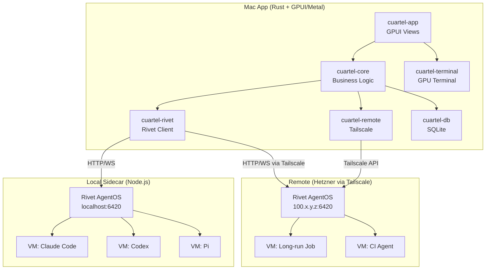
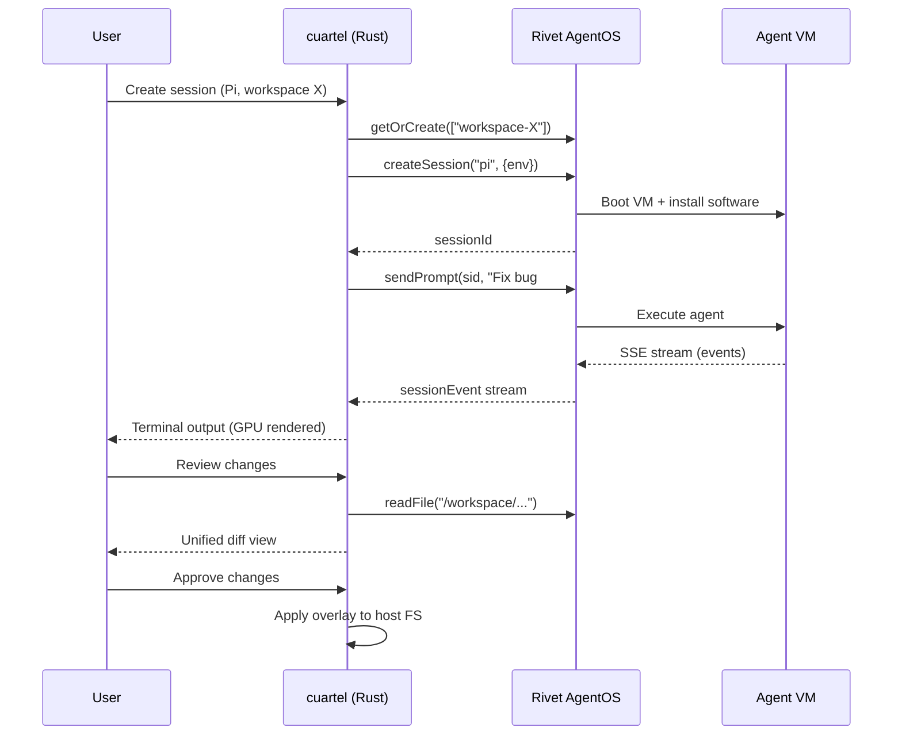
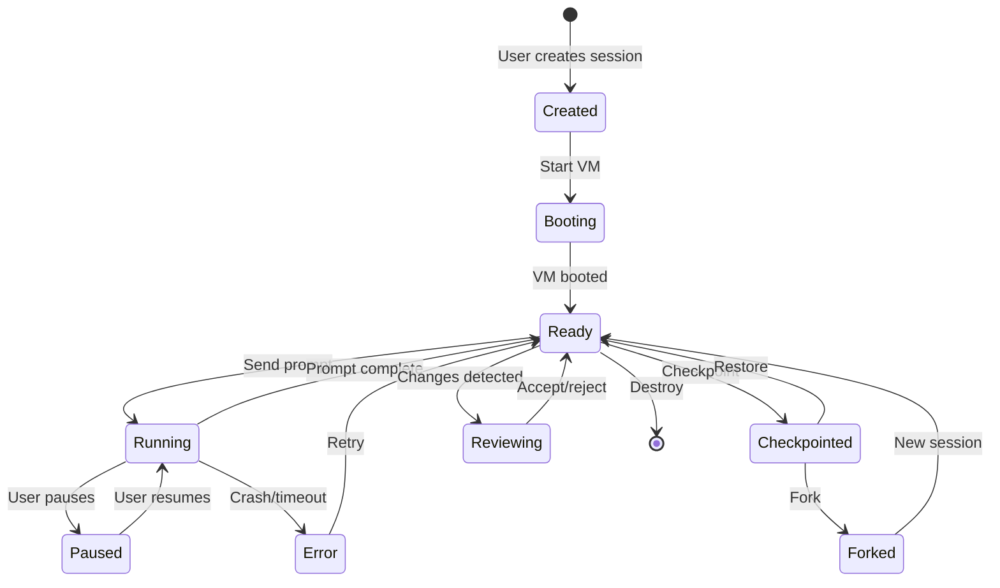

# Cuartel

A 100% Rust native macOS app, GPU-rendered with Metal via GPUI. Orchestrates AI coding agent sessions in isolated VMs using Rivet AgentOS, with local and remote execution via Tailscale.

---

## Architecture Overview



### Key Architectural Decisions

| Decision | Choice | Rationale |
|---|---|---|
| UI Framework | **GPUI** (gpui crate from Zed) | Metal-native GPU rendering, proven terminal support, SuperHQ validates the approach |
| VM/Sandbox | **Rivet AgentOS** | Unified API for local + remote, built-in persistence, multi-agent orchestration, actor model |
| Rivet integration | **Node.js sidecar** managed by the Rust app | AgentOS is a Node.js runtime; Rust app spawns/manages the sidecar, communicates via HTTP/WebSocket |
| Local storage | **SQLite** (AES-256-GCM for secrets) | Workspace config, credentials, server registry, session metadata |
| Remote connectivity | **Tailscale** | Encrypted mesh networking, no port forwarding/VPN setup, Rust crate available (`tailscale-api`) |
| Credential security | **Auth gateway pattern** | Credentials never enter VMs; injected on-the-fly into outgoing API requests by host-side proxy |

---

## Data Flow: Agent Session Lifecycle



---

## Crate Structure

```
cuartel/
├── Cargo.toml                    # Workspace root
├── crates/
│   ├── cuartel-app/              # Main GPUI application binary
│   │   └── src/
│   │       ├── main.rs           # Entry point, GPUI app init
│   │       ├── app.rs            # Global app state, menu bar
│   │       ├── workspace.rs      # Workspace view (container)
│   │       ├── sidebar.rs        # Session list, server list
│   │       ├── tab_bar.rs        # Agent tabs within workspace
│   │       ├── diff_view.rs      # Unified diff review panel
│   │       ├── ports_panel.rs    # Port forwarding management
│   │       ├── settings.rs       # Settings: keys, agents, servers
│   │       └── theme.rs          # Color scheme, fonts
│   │
│   ├── cuartel-terminal/         # GPU-accelerated terminal emulator
│   │   └── src/
│   │       ├── lib.rs
│   │       ├── terminal.rs       # PTY management, ANSI parsing
│   │       └── renderer.rs       # GPUI element for terminal grid
│   │
│   ├── cuartel-core/             # Core business logic (no UI deps)
│   │   └── src/
│   │       ├── lib.rs
│   │       ├── session.rs        # Session lifecycle, state machine
│   │       ├── agent.rs          # Agent harness registry (Pi, CC, etc.)
│   │       ├── checkpoint.rs     # Checkpoint/rewind logic
│   │       ├── overlay.rs        # Overlay FS diff computation
│   │       ├── auth_gateway.rs   # Credential injection proxy
│   │       └── config.rs         # App configuration
│   │
│   ├── cuartel-rivet/            # Rivet AgentOS client (HTTP/WS)
│   │   └── src/
│   │       ├── lib.rs
│   │       ├── client.rs         # HTTP + WebSocket client
│   │       ├── sidecar.rs        # Spawn/manage local Node.js process
│   │       ├── vm.rs             # VM CRUD, lifecycle
│   │       ├── session.rs        # Agent sessions, prompts, events
│   │       ├── filesystem.rs     # File read/write/diff
│   │       └── network.rs        # Port forwarding, vmFetch
│   │
│   ├── cuartel-remote/           # Remote server management
│   │   └── src/
│   │       ├── lib.rs
│   │       ├── tailscale.rs      # Tailscale discovery + connectivity
│   │       ├── server.rs         # Remote server registry
│   │       └── sync.rs           # Session push/pull between locations
│   │
│   └── cuartel-db/               # SQLite persistence
│       └── src/
│           ├── lib.rs
│           ├── schema.rs         # Tables: workspaces, credentials, servers
│           └── crypto.rs         # AES-256-GCM for secrets at rest
│
├── rivet/                        # Rivet AgentOS sidecar config
│   ├── package.json              # rivetkit + agent-os packages
│   ├── server.ts                 # AgentOS server entry point
│   └── tsconfig.json
│
├── migrations/                   # SQLite migrations
├── assets/                       # App icon, fonts
├── Info.plist                    # macOS app bundle metadata
├── entitlements.plist            # Virtualization, networking entitlements
└── scripts/
    └── package.sh                # Build + package as .dmg
```

---

## Session State Machine



---

## Core Features by Phase

### Phase 1 -- Scaffolding (the starting point)
- Rust workspace with all crates stubbed out
- GPUI window with sidebar + main content area
- Basic theme (dark mode)
- SQLite setup with initial schema
- Build script that produces a `.app` bundle

### Phase 2 -- Terminal + Sidecar
- GPU-accelerated terminal emulator in GPUI (adapt patterns from SuperHQ's `gpui-terminal` crate)
- Node.js sidecar management: auto-install `rivetkit` deps, spawn/monitor the Rivet server process
- Rust HTTP client for Rivet AgentOS API (using `reqwest` + `tokio-tungstenite` for WebSocket)

### Phase 3 -- Agent Sessions

Tasks in this phase are split so multiple can run in parallel. Each task lists its crate, deps, and whether it blocks others.

| ID | Task | Crate(s) | Depends on | Parallel group |
|---|---|---|---|---|
| 3a | Session state machine (Created→Booting→Ready→Running→Paused→Error) as pure logic with unit tests | `cuartel-core` | — | A |
| 3b | Rivet session API wrappers: `createSession`, `sendPrompt`, `destroySession` | `cuartel-rivet` | — | A |
| 3c | Rivet event stream client: WS/SSE subscription, typed `SessionEvent` enum | `cuartel-rivet` | — | A |
| 3d | Sidebar session list view with status indicators (static model, fixture data) | `cuartel-app` | — | A |
| 3e | Agent harness registry trait + Pi implementation | `cuartel-core` | 3a | B |
| 3f | Wire event stream into terminal output (end-to-end Pi session) | `cuartel-app`, `cuartel-terminal` | 3b, 3c, 3e | C |
| 3g | Permission prompt UI (approve/deny tool use) | `cuartel-app` | 3c | B |
| 3h | Add Claude Code / Codex / OpenCode harness implementations | `cuartel-core` | 3e | D |
| 3i | Harness availability detection (probe installed CLIs, cross-reference registry, return per-harness status) | `cuartel-core` | 3e | E |
| 3j | Onboarding flow UI (first-run modal: detected harnesses, credential entry, default selection) | `cuartel-app`, `cuartel-db` | 3i, 3k | E |
| 3k | Stopgap credential store (macOS Keychain-backed) until 5a's AES-256-GCM path lands | `cuartel-core`, `cuartel-db` | — | E |
| 3l | Default-harness wiring in `SessionHost` (read selected harness + required env vars from config, inject into sidecar process env before spawn) | `cuartel-app` | 3f, 3j, 3k | E |

**Group A** tasks (3a–3d) can all start in parallel today. Group B starts once 3a/3c land. Group C is the integration milestone. Group D is additive once 3e defines the harness trait. **Group E** is the onboarding track — see the dedicated subsection below; 3i and 3k can start in parallel immediately, 3j merges their output, and 3l plugs the result into the 3f integration.

#### Onboarding flow (3i–3l)

The first time cuartel launches — and on demand from settings afterwards — the user lands on an onboarding panel that answers three questions: *what can I run, how do I authenticate it, and which one should be the default?* The flow is driven by data from three sources:

1. **Harness registry** (from 3e) — the static list of supported harnesses (Pi, Claude Code, Codex, OpenCode, …). Each entry declares the CLI binaries / node packages it requires and the environment variables it reads for credentials. This is the source of truth for "what cuartel knows how to run".
2. **System probe** (3i) — a pure async function that, for each registered harness, runs `which` / reads `process.versions` / checks package manifests to produce a `HarnessAvailability { installed: bool, version: Option<String>, install_hint: Option<String>, required_env: Vec<EnvVarSpec> }`. No UI, no side effects — just a snapshot the UI can render against.
3. **Credential store** (3k) — a minimal key/value store scoped by provider id (e.g. `anthropic`, `openai`, `github-copilot`). For Phase 3 we back it with the macOS Keychain via the `security-framework` or `keyring` crate; 5a replaces the storage with the AES-256-GCM SQLite path without changing the read API (`get_api_key(provider_id) -> Option<String>`). This lets onboarding ship before Phase 5.

The **onboarding UI** (3j) is a focused modal that sits above the workspace:

- A **harness matrix** showing every registered harness with a status badge: `ready` (installed + all required env vars present), `needs credentials` (installed but missing keys), `not installed` (with a copy-paste install hint like `brew install pi` or `npm i -g @openai/codex`), or `unsupported on this platform`.
- An **inline credential form** for each harness that needs keys — provider-aware labels and placeholders (`ANTHROPIC_OAUTH_TOKEN` vs `ANTHROPIC_API_KEY`, `OPENAI_API_KEY`, `GEMINI_API_KEY`, …), with masked inputs and an optional "test" button that tries a cheap provider endpoint to verify the key before saving.
- A **default picker**: a radio list of the currently-ready harnesses, pinning one as the default for new sessions. The choice persists in the config store alongside credentials.
- The modal is dismissible once at least one harness is `ready` and a default is selected; otherwise cuartel keeps surfacing it (with a banner in the sidebar) since no session can be created without a usable harness.

The **default-harness wiring** (3l) changes `SessionHost` startup: before spawning the rivet sidecar, it reads the selected default harness + that harness's required env vars from the credential store and injects them into the `Command::new("npx")` environment via `.env(key, value)`. This matters because Pi / Claude Code / etc. run as subprocesses of the rivetkit server — they inherit the server's env, which inherits ours. Once 3l lands, launching cuartel with a configured ANTHROPIC_API_KEY in the onboarding flow Just Works without the user touching a shell. The current Phase 3f behaviour (terminal shows "Agent process exited" when no keys are configured) is the motivating failure mode for this whole subsection.

### Phase 4 -- Workspaces + Review

| ID | Task | Crate(s) | Depends on | Parallel group |
|---|---|---|---|---|
| 4a | Workspace model + project directory mapping (DB-backed) | `cuartel-core`, `cuartel-db` | — | A |
| 4b | Overlay FS diff computation using `similar` (pure function: base tree + overlay tree → unified diff) | `cuartel-core` | — | A |
| 4c | Diff review panel UI built against fixture diffs | `cuartel-app` | — | A |
| 4d | Rivet file read/write/list wrappers for overlay snapshotting | `cuartel-rivet` | — | A |
| 4e | Mount project at `/workspace` inside VM via Rivet filesystem API | `cuartel-core` | 4a, 4d | B |
| 4f | Accept/reject per-file and per-hunk application to host FS | `cuartel-core`, `cuartel-app` | 4b, 4c, 4e | C |
| 4g | Multiple tabs per workspace (multi-agent same project) | `cuartel-app` | 4a, 3f | C |

**Group A** (4a–4d) is fully parallel. 4c in particular can ship without any VM — just render fixture diffs.

### Phase 5 -- Security + Ports

Split cleanly into three independent tracks; any two can be built in parallel by different agents.

| ID | Task | Crate(s) | Depends on | Track |
|---|---|---|---|---|
| 5a | Encrypted credential storage: AES-256-GCM wrapper + `credentials` table + CRUD | `cuartel-db`, `cuartel-core` | — | Storage |
| 5b | Settings UI for managing API keys / OAuth tokens | `cuartel-app` | 5a | Storage |
| 5c | Auth gateway reverse proxy: intercept outgoing VM requests, inject credentials by hostname rule | `cuartel-core` (new `auth_gateway.rs`) | 5a | Gateway |
| 5d | Audit log of credential-injected requests | `cuartel-core`, `cuartel-db` | 5c | Gateway |
| 5e | Port forwarding: sandbox→host and host→sandbox, opt-in per port | `cuartel-rivet`, `cuartel-app` | — | Ports |
| 5f | Firewall rules ensuring VMs cannot reach credential storage | `cuartel-core` | 5c | Gateway |

**Storage**, **Gateway**, and **Ports** are independent tracks. 5a and 5e can start the same day.

### Phase 6 -- Checkpoint + Rewind

| ID | Task | Crate(s) | Depends on | Parallel group |
|---|---|---|---|---|
| 6a | Rivet checkpoint API client (create, list, restore, delete) | `cuartel-rivet` | — | A |
| 6b | Checkpoint metadata table + core API | `cuartel-core`, `cuartel-db` | — | A |
| 6c | Timeline UI rendering checkpoint history | `cuartel-app` | 6b | B |
| 6d | Fork-from-checkpoint flow (spawns new session branch) | `cuartel-core` | 6a, 6b, 3a | B |

### Phase 7 -- Remote via Tailscale

| ID | Task | Crate(s) | Depends on | Parallel group |
|---|---|---|---|---|
| 7a | Tailscale discovery: list tailnet peers, reachability check | `cuartel-remote` | — | A |
| 7b | Server registry table + CRUD (local + remote entries) | `cuartel-db`, `cuartel-remote` | — | A |
| 7c | Server list UI in sidebar | `cuartel-app` | 7b | B |
| 7d | Point rivet client at configurable base URL (local vs remote) | `cuartel-rivet` | — | A |
| 7e | Session sync: push/pull session state between servers | `cuartel-remote` | 7a, 7b, 7d, 3b | C |

### Phase 8 -- Orchestration

| ID | Task | Crate(s) | Depends on | Parallel group |
|---|---|---|---|---|
| 8a | Multi-agent pipeline DAG (coder → reviewer → tester) | `cuartel-core` | 3h | A |
| 8b | Cron scheduler for agents | `cuartel-core` | 3a | A |
| 8c | Durable workflow wrapper over Rivet's workflow engine | `cuartel-rivet`, `cuartel-core` | — | A |
| 8d | Agent-to-agent file passing protocol | `cuartel-core` | 4e | B |

---

## Parallelism Quick Reference

At any given moment, these tasks have no shared files and can be built in separate worktrees:

- **Right now:** 3a, 3b, 3c, 3d, 3i, 3k, 4a, 4b, 4c, 4d, 5a, 5e, 6a, 6b, 7a, 7b, 7d
- **Bottleneck tasks** (many others wait on them): 3a (state machine), 3e (harness trait), 5a (credential storage), 3f (first end-to-end Pi integration), 3j (onboarding UI unblocks actually running any harness in the app)
- **Integration-only tasks** (must be done serially by a single agent): 3f, 3l, 4f, 5d, 7e

---

## Key Dependencies

| Crate | Purpose |
|---|---|
| `gpui` (unofficial) | GPU-accelerated UI framework via Metal |
| `reqwest` | HTTP client for Rivet API |
| `tokio-tungstenite` | WebSocket client for real-time event streaming |
| `rusqlite` | SQLite for local persistence |
| `ring` or `aes-gcm` | AES-256-GCM encryption for secrets |
| `tailscale-api` | Tailscale network discovery and management |
| `similar` | Diff computation for review panel |
| `alacritty_terminal` | Terminal emulation (VT100/ANSI parsing) |
| `serde` / `serde_json` | Serialization for Rivet API protocol |
| `tokio` | Async runtime |
| `notify` | Filesystem watching for overlay changes |

---

## Rivet AgentOS Integration Detail

The Rust app does NOT embed Rivet (it's Node.js). Instead:

1. **Local**: On first launch, `cuartel` checks for Node.js, installs the `rivet/` sidecar deps (`npm install`), then spawns `npx tsx server.ts` as a managed child process. The Rust app connects to `http://localhost:6420`.

2. **Remote**: User configures a Hetzner/any server in settings. The server runs its own Rivet AgentOS instance. The Rust app connects to it via Tailscale at `http://100.x.y.z:6420`.

3. **API Surface** (Rust client wraps these):
   - `POST /vm/getOrCreate` -- create/get VM instance
   - `POST /vm/{id}/createSession` -- start agent session
   - `POST /vm/{id}/sendPrompt` -- send prompt to agent
   - `WS /vm/{id}/events` -- stream session events
   - `GET /vm/{id}/readFile` -- read file from VM
   - `POST /vm/{id}/writeFile` -- write file to VM
   - `POST /vm/{id}/exec` -- execute command in VM

---

## Security Model

```
+-------------------------------------------+
|  cuartel (Host)                           |
|  +--------------+  +----------------+     |
|  | Auth Gateway  |  | Encrypted DB   |     |
|  | (injects keys |  | (AES-256-GCM)  |     |
|  |  on-the-fly)  |  | API keys,      |     |
|  +------+-------+  | OAuth tokens   |     |
|         |          +----------------+     |
|         v                                 |
|  +--------------+                         |
|  | Rivet AgentOS|                         |
|  | (no secrets) |                         |
|  +------+-------+                         |
|         |                                 |
|  +------v-------+                         |
|  |  Agent VM    | <- no API keys here     |
|  |  (isolated)  | <- outgoing requests    |
|  |              |   go through gateway    |
|  +--------------+                         |
+-------------------------------------------+
```

- Credentials stored in encrypted SQLite, never passed to VMs
- Auth gateway intercepts outgoing API calls and injects credentials
- VMs have no network access to credential storage
- Audit log of all credential-injected requests

---

## Phase 9 -- Multi-Agent Harness Support (Claude Code, Codex, OpenCode via ACP)

The current architecture hardcodes Pi as the only agent. This phase makes the
default harness configurable and adds Claude Code as a first-class agent via
the `@agentclientprotocol/claude-agent-acp` adapter.

### Background: ACP (Agent Client Protocol)

ACP is a JSON-RPC protocol over stdin/stdout that standardises how coding
agents communicate with host applications. Both Pi and Claude Code now ship
ACP adapters:

- **Pi**: `@rivet-dev/agent-os-pi` (already in `rivet/`)
- **Claude Code**: `@agentclientprotocol/claude-agent-acp` (new — wraps
  `@anthropic-ai/claude-agent-sdk`)

Each adapter declares capabilities (image input, tool calls, thinking modes,
etc.) and translates agent events into ACP notifications. The rivet sidecar
spawns the adapter as a subprocess and speaks ACP over stdin/stdout.

### Key insight from SuperHQ

SuperHQ (`github.com/superhq-ai/superhq`, a sister project with almost
identical architecture) demonstrates the full pattern:

- Agent configs declare `InstallStep` pipelines (download Node.js, npm install
  agent packages, write hook configs)
- An auth gateway reverse-proxy intercepts outbound API requests, swapping
  dummy keys (`sk-shuru-gateway`) for real credentials — agents never see the
  real keys
- The `claude-agent-acp` package handles image input in prompts, tool calls,
  edit review diffs, thinking modes, and permission requests over ACP

### Tasks

| ID | Task | Crate(s) | Depends on | Parallel group |
|---|---|---|---|---|
| 9a | Make `SessionHost` agent type configurable (read from onboarding/config instead of hardcoded `"pi"`) | `cuartel-app` | 3l | A |
| 9b | Add `@agentclientprotocol/claude-agent-acp` to rivet sidecar deps + `@rivet-dev/agent-os-core` `claude` agent config | `rivet/` | — | A |
| 9c | Create `@rivet-dev/agent-os-claude` package (ACP adapter for Claude Agent SDK) or use upstream `claude-agent-acp` directly | `rivet/` | 9b | A |
| 9d | Update `rivet/server.ts` to register both `pi` and `claude` agents with AgentOS | `rivet/` | 9b, 9c | A |
| 9e | Add per-agent `models.json` overrides for the AgentOS VM: force Pi to use `anthropic` provider when `ANTHROPIC_API_KEY` is present | `rivet/` | 9d | B |
| 9f | Update onboarding UI to show Claude Code as a harness option and persist the choice | `cuartel-app`, `cuartel-core` | 9a | B |
| 9g | Auth gateway proof-of-concept: reverse proxy that injects API keys into outbound Anthropic/OpenAI requests | `cuartel-core` (new `auth_gateway.rs`) | 5a | C |

### AgentOS agent configs (reference from agent-os-core)

The `AGENT_CONFIGS` object in `@rivet-dev/agent-os-core/dist/agents.js` already
defines entries for `pi`, `pi-cli`, `opencode`, and `claude`. The `claude`
entry uses:

```
acpAdapter: "@rivet-dev/agent-os-claude"
agentPackage: "@anthropic-ai/claude-agent-sdk"
defaultEnv: { CLAUDE_AGENT_SDK_CLIENT_APP, CLAUDE_CODE_SIMPLE, ... }
```

### Pi provider configuration inside AgentOS VM

The AgentOS VM runs isolated from the host filesystem. Pi's normal
`~/.pi/agent/settings.json` (which may point to `google-antigravity`) is NOT
available inside the VM. Two mechanisms ensure Pi uses the injected
`ANTHROPIC_API_KEY`:

1. **`extra_env()` on the harness** (`cuartel-core/src/agent.rs`):
   `PiHarness::extra_env()` returns `PI_DEFAULT_PROVIDER=anthropic` and
   `PI_DEFAULT_MODEL=claude-sonnet-4-20250514`. These override Pi's
   `settings.json` defaults so the agent uses the Anthropic provider even if
   the user's local Pi config points to a different one.

2. **`createSession({ env })`** (`cuartel-app/src/session_host.rs`): The
   credential-store env vars (including `ANTHROPIC_API_KEY` and the
   `PI_DEFAULT_*` vars above) are passed through the `createSession` action's
   `options.env` parameter. The AgentOS `createSession` method merges these
   into `launchEnv` which becomes the spawned process's environment inside the
   VM. Without this, the VM process has no API key and Pi crashes with
   "Agent process exited".

   Flow: `main.rs` builds `sidecar_env` → `CuartelApp` passes it to
   `SessionHost::new` → `run_driver` passes it to
   `client.create_session(agent_id, "pi", { env })` → rivetkit forwards to
   `AgentOs.createSession(agentType, options)` → `launchEnv = { ...defaultEnv,
   ...extraEnv, ...options.env }` → `kernel.spawn("node", [...],
   { env: launchEnv })` → VM process inherits env vars.

### npm `call-bind` symlink issue

The `npm install` in `rivet/` can leave a broken hoisted directory at
`node_modules/call-bind` (empty dir instead of a symlink or copy). This is a
transitive dependency of `which-typed-array` (required by `@mariozechner/pi-ai`
inside the VM). The AgentOS VM's esbuild bundler resolves module paths from
`/root/node_modules/`, and the `call-bind` directory being empty causes a
build-time crash:

```
✘ [ERROR] Could not resolve "call-bind"
    node_modules/which-typed-array/index.js:5:23
```

**Fix**: if the top-level `node_modules/call-bind` is empty after `npm install`,
copy the working copy from the nested location:

```bash
rm -rf rivet/node_modules/call-bind
cp -r rivet/node_modules/@rivet-dev/agent-os-pi/node_modules/call-bind \
      rivet/node_modules/call-bind
```

This should be added to the `rivet/postinstall.sh` script or checked in CI.

---

## What to Build First

Start with **Phase 1 + Phase 2** together: get a GPUI window with a working terminal and a running Rivet sidecar. This validates the entire stack end-to-end (Rust -> GPUI -> Metal rendering + Node.js sidecar -> Rivet AgentOS) before investing in features.
